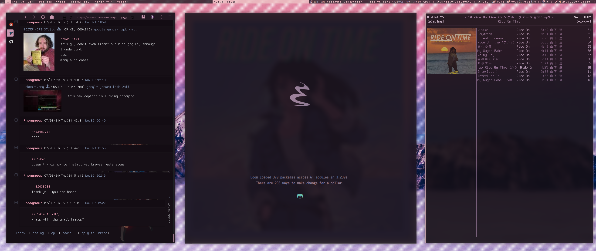

Dotfiles that i use for both my laptop and desktop.

These dots are used with Arch Linux with dwm as its window manager.

# Programs used #
* Distro : Arch Linux
* Window Manager : dwm
* Terminal : Kitty
* Browser : firefox
* Music Player : ncmpcpp
* File Manager : ranger
* Notifications : dunst
* Video Player : mpv

# Features #

* dwm built off of LukeSmith's build, with added patches such as: awesomebar, movereise,  attachbottom, more layouts and cfacts
* dwmblocks with various modules such as: wifi, bluetooth, dual battery status, memory usage, temperature, etc.
* riced ncmpcpp with cover art
* riced dunst with mpd notifications
* mpv with shaders and upscalers
* scripts for powermenu and select layout
* firefox with custom css
* Doom Emacs with my config 

# Before Installing #

Various of these dots contain my username so they won't work for you outside of the box

# For a quick Install please install the following packages:

> paru -S firefox neovim ranger dragon-drag-and-drop zsh 
  terminus-font adobe-source-han-sans-jp-fonts ttf-joypixels 
  otf-san-francisco-pro kitty blueman ncmpcpp dunst i3lock-color-git 
  xss-lock ibus ibus-mozc libxft-bgra lxappearance lxrandr maim mpc 
  mpd mpv neofetch throttled nitrogen pcmanfm qbittorrent picom 
  thunderbird tlp tlpui ueberzug zathura youtube-dl lightdm 
  terminus-font-ttf xdg-utils-mimeo feh sxiv code bpytop htop 
  pavucontrol xbacklight redshift wmctrl nerd-fonts-fira-code
  emacs

# Enable the following services:

> systemctl --user enable mpd

> systemctl --user enable mpd-notification

> systemctl enable tlp

> systemctl enable throttled

> systemctl enable bluetooth

> systemctl enable sshd

> systemctl enable lightdm

# After Install

First of all you should configure TLP to your liking, which you can do with tlpui.
Then, if your using a laptop, you probably want to undervolt. Here's my config for my T480 with a I7-8665u:
*NOTE: This is done on /etc/lenovo_fix.conf for my Thinkpad

* [UNDERVOLT.BATTERY]

 CPU core voltage offset (mV)

CORE: -105
 Integrated GPU voltage offset (mV)

GPU: -85

 CPU cache voltage offset (mV)

CACHE: -105

 System Agent voltage offset (mV)
  
UNCORE: -85

 Analog I/O voltage offset (mV)

ANALOGIO: 0 

After that i set up cron, so i get my notes on org-mode backed-up
- crontab -e # Install if not installed
- *****/30 * * * * /home/hakuya/.local/bin/ObsidianSync >/dev/null 2>&1 
- This script is documented on .local/bin

